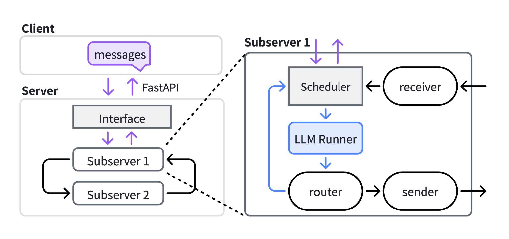
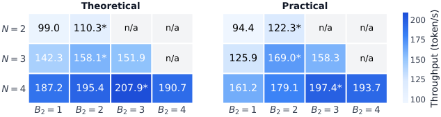

---

## 论文: TokenRouter: Efficient Serving System for Token-Level LLM Routing
arxiv: 2610.12242
日期: 2026-10-10
子方向: serving-system
状态: 精读完成

# TokenRouter: Efficient Serving System for Token-Level LLM Routing

> 清华 NICS 组。解决 token 级 LLM 路由（token-level routing）在现有 serving 系统上跑不起来的问题。

## 背景与动机

**白话版**：想象一个团队里既有「资深专家」（大模型，答得好但慢且贵）又有「年轻快手」（小模型，答得快但简单题才靠谱）。现在的做法是客户来电时先判断难题简单题，然后把**整通电话**转给某一个人。新思路是**逐句转接**：快手客服聊着聊着遇到拿不准的句子，立刻把这一句转给专家，专家答完再转回来——又快又好。问题是现有电话系统（vLLM/SGLang）压根不支持「一句话一转」，硬改会让两个客服互相干等、电话转接排队。TokenRouter 就是重造了一套支持「逐句转接」的电话系统。

- LLM 路由已在生产广泛使用，但都是**粗粒度**（session/query 级）：一次请求只绑一个模型。
- 算法侧新趋势是 **token 级路由**：每个 token 都可切换模型。收益巨大——R2R 只把 5% 的 token 路由给 32B 模型（其余 1.5B 生成），就能追平 32B 质量；而 query 级路由要 40% 请求给大模型。（注意：这是特定操作点的实验结果，高吞吐端有真实质量损失，展开见 Q&A Q7）
- 但 vLLM/SGLang 假设「一个请求始终在一个模型上」，token 级路由打破该假设，三大挑战：
  1. **步失同步（step desynchronization）**：不同模型每步延迟差异大，单批同步等待最慢者，快模型空转——像跑步比赛强制大家手拉手过终点，跑得快的也得陪着慢的走。
  2. **批准入延迟（batch admission delay）**：token 路由频繁换模型，请求常在目标模型正忙时到达，等下个批次入队——像食堂窗口只有一个队列，转来的客人必须等当前一整批打完饭。
  3. **实现复杂**：现有系统无 per-step 路由接口，硬改大代码库且要与 continuous batching / prefix caching 纠缠。

## 方法

核心设计原则：**request-centric programming, model-centric execution**——开发者只描述单请求视角的路由逻辑，运行时用模型中心的异步 subserver 高效执行。

### 关键图表

**图 2：系统架构（route-send-receive + 三循环解耦执行）**

> 左侧是路由粒度示意（session/query/token 级）；右侧系统架构：每个 LLM 一个 subserver，跑 client-server（紫）、decoding（蓝）、inter-model（黑）三个解耦循环；开发者只实现 route/send/receive 三个函数。对客户端是单端点。[SVG 原图](https://arxiv.org/html/2610.12242#S1.F2)

**图 4b：延迟批调度（delayed batching）**

> 核心直觉：新请求到达时若目标模型正在出批，稍等一小撮后续请求一起入批，比立即入批平均等待更短（像公交司机看到远处有人跑来，稍等 10 秒一起载，好过空车走了再等下一班）。最优等待时长由数学吞吐模型推导，不靠手调。[SVG 原图](https://arxiv.org/html/2610.12242#S4.F4)

**表 2（关键结果，转 markdown）：并发 4 下各系统对比**

| 系统 | 吞吐 (token/s) | TTFT | 端到端延迟 |
|---|---|---|---|
| 官方 R2R 实现 | 基线 | 基线 | 基线 |
| 工程优化版 | +1.71x | — | — |
| **TokenRouter** | **+2.76x（SLO 紧时 +18.58x）** | 单端点无感 | 单端点无感 |

> 完整数据见 [arXiv HTML 版 Table 2](https://arxiv.org/html/2610.12242#S5.T2)；吞吐对比图（Figure 5/6 为 SVG）：[Figure 5 吞吐](https://arxiv.org/html/2610.12242#S5.F5) · [Figure 6 延迟](https://arxiv.org/html/2610.12242#S5.F6)

三个机制：

1. **route-send-receive 编程接口**（开发者只写三个函数）：
  - `route(result)`：每步 decode 后调用，按 logits/hidden states 决定每个请求去哪个模型（0=本地继续，非 0=peer 索引）。
  - `send(req)`：委托时打包 PeerReq（请求 ID、peer 未见过的 token 后缀、位置锚点、状态）。
  - `receive(peer_req)`：收到 PeerReq 转本地格式继续解码（默认收全部 token，特殊算法可覆盖）。
  - 例：R-Stitch 在 SLM 侧用 token 熵 > τ 判断交给 LLM，并把不确定的 token 丢弃让 LLM 重新生成。
2. **解耦三环执行（decoupled tri-loop）+ handoff-resume**：
  每个 LLM 一个自治 subserver，跑三个解耦循环（client-server / decoding / inter-model），消除步失同步；handoff-resume 机制简化跨模型切换的状态转移。
3. **延迟批调度（delayed-batching scheduler）**：
  稍等一小段再入批，摊薄平均批准入延迟；最优等待超参由系统的**数学吞吐模型**推导（不是手调）。

## 实验（关键数字）

- 5 种路由算法（CITER/R2R/Co-LLM/R-Stitch/ME）、多负载与模型对上，解码吞吐比现有实现高 **2.01–64.15x**（最差场景翻倍、最好场景快 64 倍——原来 1 小时的活最快 1 分钟干完）。
- 增益分解（并发 8）：纯工程优化（在官方 R2R 实现上）+1.71x，TokenRouter 整体 +2.76x。
- 严格 SLO 下吞吐比 R2R 高 **18.58x**——数学模型推导的调度超参在紧 SLO 下收益最大。
- 兼容性：对客户端是**单端点**，可 drop-in 替换单模型 serving（用户无感知，像换了个更快的插座）。

## 复现要点

- **代码**：[https://github.com/thu-nics/TokenRouter（开源）](https://github.com/thu-nics/TokenRouter（开源）)
- **数据集/负载**：论文用 5 种路由算法 × 多模型对（1.5B/7B/32B 级）；复现建议从 R-Stitch（熵阈值，无需训练 router）入手，模型对 Qwen2.5-1.5B + 7B。
- **关键超参**：delayed-batching 等待时长（论文用吞吐模型推导；复现可先扫 0/1/2/4ms 观察吞吐-SLO 曲线）。
- **最小复现路径**：clone → 起 SGLang 后端的两个 subserver → 跑 R-Stitch 示例 → bench 并发 8/16/32 的吞吐与 TTFT/TPOT。
- **观察指标**：吞吐、SLO 达标率（goodput）、模型间切换频率、批大小分布。

## 启发与局限

- **启发**：
  - 「算法-系统共同设计」范本：算法侧的 token 级路由理论收益，靠系统侧三招（异步 subserver / 延迟入批 / 吞吐模型调参）才兑现——好比新药（算法）必须配新剂型（系统）才能真正起效。这种「算法进展倒逼 serving 系统重构」的模式会反复出现（类比投机解码对系统的改造）。
  - request-centric 抽象把异步复杂性藏进 runtime，与 SGLang 的结构化生成控制流思路同源：**把策略留給开发者、把执行留给系统**（开发者只管说「什么时候转接、转给谁」，怎么转接高效是系统的事）。
  - 数学吞吐模型推导调度超参 > 手调——像用流体力学算水管流量定阀门开度，而不是试出来的。
- **局限**：
  - 路由信号（熵/置信度）依赖 logits，对 logits 被隐藏的 API 模型不适用（电话转接系统需要听到客服的语气，但如果客服只发文字稿给你就没法判断了）。
  - 两模型为主（ME 扩展到多模型但实验有限）；跨节点（非单机多卡）场景未充分评估。
  - KV 状态跨模型不共享，handoff 只传 token 后缀——好比转接电话时新客服听不到之前的录音，只能听同事口头复述前面聊了什么，聊得越长复述成本越高。前缀缓存只在本模型内有效，长上下文跨模型切换的 KV 传输是潜在瓶颈。

## 疑问清单（Agent 主动提出）

> 精读时列出的开放问题，可挑选追问（在对话中说「回答疑问清单第 2 条」即可）：

1. KV 状态跨模型不共享：当对话上下文很长（如 32K+）且路由频繁切换时，每次 handoff 都要传 token 后缀重新 prefill，累计开销会不会吃掉吞吐增益？
2. delayed-batching 的数学吞吐模型假设什么负载分布？对突发的长 prefill 请求（如 RAG 场景的大段检索结果）是否还准？
3. 与投机解码共存性：token 路由（大模型只接 5% 难 token）与投机解码（小模型起草大模型验证）本质都在做「大小模型分工」，两者能否叠加？谁先谁后？（对比分析见 Q5；叠加性论文未实验，待开源后续）

> ❓ **Q:** 步失同步为什么不能靠加同步锁解决？（2026-10-10 示例追问）
>
> **A:** 同步锁的语义是「所有模型每步对齐、等最慢者」，这恰好放大了要解决的问题——快模型被锁住跟着慢模型的节奏空转，吞吐退化为最慢模型的水平。TokenRouter 的解法是根本不同步：每个模型一个自治 subserver，各自维护独立的 continuous batching；请求像消息一样在模型间流转（route-send-receive），快模型在等待某个慢请求回来期间可以继续服务自己的批。代价是同一请求的 KV 状态分散在多个模型上，需要 handoff 机制管理 token 后缀与位置锚点。（2026-10-10 答）

## 新学到的术语

- token-level routing（token 级路由，已加入词汇表 learning）
- step desynchronization / batch admission delay（已加入 learning）
- R2R（Route-to-Reason，5% token 给大模型追平质量，已加入 learning）

## Q&A

### Q1（2026-10-10）：delayed-batching 的最优阈值 B* 具体怎么推导？为什么不直接手调一个经验值？

> 摘自论文 §4.3「Throughput-optimal threshold」（全文缓存 `.fulltext/2610.12242.txt`）：
>
> 推导方式是把路由过程建模为 **离散时间马尔可夫链（DTMC）**：给定路由算法、并发数 N、路由概率矩阵 P、每个 LLM 的单步解码延迟 L_i，模型推出吞吐关于阈值 B 的解析函数，搜索使吞吐最大的 B*（完整推导在附录 D）。
>
> 不能手调的原因是 B 存在严格的双向权衡：B 太小 → 批准入延迟大（token 路由下模型切换频繁、到达稀疏）；B 太大 → 请求困在队列、SLM 缺活干（starvation）。且最优值随负载/路由概率动态变化，经验值无法覆盖。实测该数学推导在紧 SLO 下收益最大（吞吐比 R2R 官方实现高 18.58x）。
>
> 关联：这呼应了 serving 领域「用排队论/马尔可夫模型做调度决策」的传统（如经典文献对 M/G/1 批处理的建模），值得在 notes/insights/ 里沉淀一篇「吞吐模型驱动的调度调参」主题笔记。

### Q2（2026-10-10）：动机里「R2R 5% vs query 级 40%」这行到底在说什么？

> 源自对「背景与动机」节该行的划线追问（层 1 提问 → 层 3 确认后沉淀）。

**白话版**：同一份答案里，大部分字其实「很好写」，只有少数几个字是「坎」。

- **query 级路由**（老做法）：先判断题目难易，**整篇**答案绑给一个模型。判断只能一刀切——题目只要看起来偏难，几百上千 token 全让贵的 32B 写，哪怕其中 95% 的内容 1.5B 也写得出来。
- **token 级路由**（新做法）：逐字转接。1.5B 一直写，写到拿不准的那个字立刻转给 32B，32B 写**一个 token** 就转回来。

所以 R2R 的数字是：只让 32B 写 5% 的 token，最终质量就追平全程 32B；而 query 级路由要做到同等质量，得把 40% 的**整条请求**都丢给 32B。**5% vs 40%**——粒度从「题目级」细化到「字级」，这就是收益来源。这行是整篇笔记的动机锚点：正因为算法侧证明了这种量级的收益，才值得系统侧（TokenRouter）大动干戈重造 serving 引擎去支持它。

**技术细节**（论文 Introduction，全文缓存第 23 行）：R2R 的路由信号是 **predicted-divergent token**——router 预测「小模型和大模型在这里会写出不同的字」时才转大模型，且大模型只生成一个 token 即交还控制权（论文 Table 1）。转接判断的依据是「这个字难不难」，而不是「这道题难不难」。对照面：query 级路由的代表工作 RouteLLM 用偏好数据训练 router 做整题分流，ChatGPT/Cursor 等生产系统目前也都是 query 级。

关联：疑问清单第 3 条——R2R「大模型只接 5% 难 token」与投机解码「小模型起草、大模型验证」本质都在做大小模型分工，形式高度相似，值得深挖两者的可叠加性。

### Q3（2026-10-10）：R-Stitch 的 SLM 侧逻辑是什么？对称设计「Stitch」指什么？

**白话版**：小模型每写一个字给自己算「纠结度」（token 熵，归一化到 0~1）——不纠结就接着写；很纠结（熵 > τ，论文 τ=0.03）就把**刚写的那个不靠谱的字划掉**，只把前文递给大模型，让它从那个位置**重新写**。大模型写回来的字小模型全盘照收。

三个函数的分工（论文 Figure 3，全文缓存 83–123 行）：

- `route`：对 next_token_logits 做 softmax 算归一化熵，熵 > τ → 转大模型（peer_idx），否则本地继续。
- `send`：丢弃刚解码的不确定 token，只传 peer 未见过的 token 后缀 + 位置锚点——反正那个字不靠谱，让大模型推翻重写而非迁就续写。
- `receive`：默认实现，大模型返回的 token 全部接受。

**独特之处是对称**（名字「Stitch/缝合」的由来）：其他算法（CITER/R2R/Co-LLM）是单向的——大模型只写一个 token 就还回来；R-Stitch 的大模型侧代码一样，只是方向反过来（`>` 换 `<=`）：大模型接手后一直写，直到字变**简单**（熵 ≤ τ）才交还小模型。最终答案是「一段大模型、一段小模型」交替缝出来的。复现注意：R-Stitch 免训 router（纯熵阈值，门槛最低）但**官方代码未开源**（Table 2 中 Official Code 为 N/A），TokenRouter 实现是目前唯一可跑的版本；论文配置 Qwen3-0.6B/32B、τ=0.03，吞吐与 LLM-only 基本持平（140.6 vs 150.4 tok/s）但延迟降为 151s vs 361s。

### Q4（2026-10-10）：TokenRouter 效果有损吗？各任务准确率降多少？

**前提纠正**：TokenRouter 是 serving 系统（执行引擎），不是路由算法——它不改变输出内容，对算法无损（§5.2 同算法下与官方实现输出一致，只比吞吐/延迟）。「有没有损」取决于跑在上面的算法：

- **省成本型**（R2R/CITER/Co-LLM）：设计目标就是「不掉点」，R2R 声称 5% token 给 32B 可追平质量（AIME）——但这是**特定操作点的实验结果**，非全曲线属性（见 Q7）。
- **提质型**（ME、分布融合类）：目标是**超过**任何单模型。
- **纯启发式**（R-Stitch 熵阈值）：无理论保证，可能掉点。

**论文没给「路由 vs 纯 32B」准确率对照表**（正文表全在比吞吐/延迟，质量结论引用各算法原文；唯一质量实验 Figure 7 见 Q7）。**警惕**：基准全是数学/常识题（AIME/AMC/CommonsenseQA/GSM8K），开放式生成、代码任务的可靠性未验证；token 路由也**没有投机解码那种数学无损保证**。

### Q5（2026-10-10）：多部署一个小模型不是要多占一张卡吗？

**白话版**：恰恰相反——论文部署是 SLM 与 LLM **共享同样的 GPU**（CUDA MPS 多进程共享，§5.1）：8×A100 上 32B 占 2 卡（TP=2），0.6B 就塞在这 2 卡里。小模型不是「额外成本」而是「替工」：0.6B 权重仅 ~1.2GB、单步计算量是 32B 的几十分之一，却干了 95% 的活。

账要按「**达到质量 Q 需要几张卡**」算，而非「部署了几个模型」：同硬件同质量下（实验显存配额对齐），R2R 场景纯 32B 145.3 tok/s vs TokenRouter 244.6 tok/s（Table 2）——同样的卡吞吐多 68%，每 token 成本降约四成。**边界条件**：若现有集群负载本就不满，加路由无益——它解决「质量顶格但算力/成本紧张」的场景。

### Q6（2026-10-10）：相对投机解码有什么优势？

两者都是「大小模型分工」但方向相反：投机解码 = 小模型打草稿、大模型逐字批改（草稿只是加速手段，输出 ≡ 纯大模型）；token 路由 = 小模型主笔、大模型只救场（大模型真的只写 5% 的字）。

| | 投机解码 | token 路由 |
|---|---|---|
| 质量上限 | 永远 = 大模型（数学无损，但不能更好） | 可调：追平大模型（省钱）或超过大模型（互补专家拼接） |
| 大模型算力 | 一个省不掉（每批草稿都要大模型验证） | 直接砍 ~95% |
| 旋钮 | 只有快慢，质量动不了 | 整条 cost-quality 曲线平滑可调 |

系统层面（§2）：投机解码两模型**紧耦合周期模式**（起草一批→验证一批），现有 vLLM/SGLang 直接支持；token 路由是**数据依赖的随机切换**，所以才需要 TokenRouter 重做异步调度。两者局限同源：都依赖大模型 logits，API 模型都用不了。理论上可叠加（每个 subserver 内部再开投机解码），论文未实验——即疑问清单第 3 条的后半，待开源后续。

### Q7（2026-10-10）：Figure 7 显示高吞吐端几乎所有算法 Accuracy 都下降，这说明了什么？

（用户看图发现的，修正了 Q2/Q4 的表述。）

**这张图本来就长这样**：横轴吞吐是用「路由旋钮」扫出来的——旋钮右拧 = 更多 token 给小模型 = 更便宜但质量天花板更低。右端≈全小模型，左端≈全大模型，曲线是「代价表」，掉点是预期而非瑕疵。

**正确读法**：Pareto 图不比曲线自身左高右低（都会），比**曲线相对位置**——同吞吐谁的准确率高、同准确率谁的吞吐高。论文声称「new Pareto frontier」= TokenRouter 曲线整体在 query 级路由（RouteLLM）**左上方**（同价更准、同准更快），这才是贡献，不是消灭 trade-off。

**对「R2R 追平 32B」的修正**：(1)「追平」只是曲线上的一个操作点（5% 路由的甜点），把路由比例压低（吞吐右推）就进入真实掉点区；(2) Figure 7 模型对是 Qwen3-**0.6B**/32B，比 R2R 原文 1.5B 弱一截，同样路由比例下小模型拖后腿更多、右端掉得更狠——「几乎所有算法高吞吐掉点」与此自洽；(3) 严谨表述：token 路由把可调范围从离散档位变成连续曲线且整体优于 query 级路由，但**高吞吐端的准确率损失真实存在、明码标价**。

**实用结论**：生产选「膝盖点」（准确率刚开始明显下弯之前）——通常 90%+ 质量换 2–3 倍吞吐；位置取决于业务容错（数学错一个 token 全毁→靠左；文本宽松→可右）。

